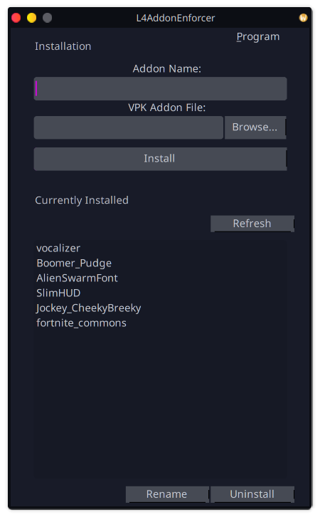
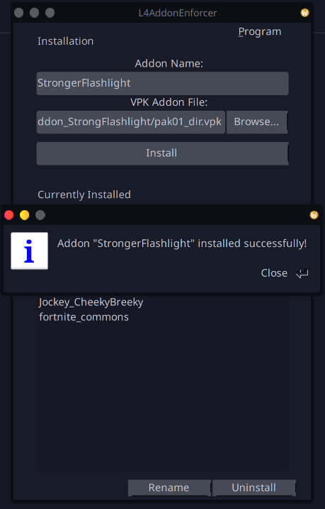
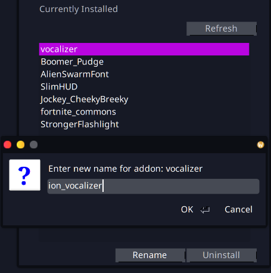
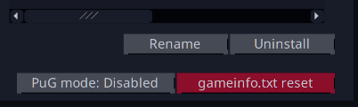

L4AddonEnforcer
-----------
An addon installer for Left 4 Dead 2 that will let you use them on official servers.

### GUI
 


Since v0.3.0 there's a PuG mode switch (on/off) to temporarily restore the vanilla backup, to let you play on servers that impose file consistency. As well as a button to completely and irreversibly reset the current gameinfo to the default.



### CLI Usage

#### Installation

`L4AddonEnforcer -f <path to the *.vpk> -n <name>`

**`-f`** corresponds to the original VPK addon file that will be copied (as pak01_dir.vpk) to the later created addon directory.

**`-n`** corresponds to the common name of the addon, a directory that will be named after, and an entry in the gameinfo.txt.
You can name it whatever you like, to later know what that addon is.

Example (linux): `./L4AddonEnforcer -f /home/user/Downloads/ion_vocalizer.vpk -n vocalizer`</br>
Example (windows): `L4AddonEnforcer.exe -f C:\Users\User\Downloads\ion_vocalizer.vpk -n vocalizer`

**The same way you can update an already installed addon.**

#### List of already installed addons

`L4AddonEnforcer -l`

Example output: 
```
Installed addons:
        vocalizer
        fortnite_commons
        AlienSwarmFont
        SlimHUD
        Jockey_CheekyBreeky
        Boomer_Pudge
```

***The list doesn't include the base game components***
#### Uninstallation

`L4AddonEnforcer -u <name>`

**`-u`** corresponds to the name of the already installed addon.

Example (linux): `./L4AddonEnforcer -u AlienSwarmFont`</br>
Example (windows): `L4AddonEnforcer.exe -u AlienSwarmFont`

#### Renaming

`L4AddonEnforcer -r <old_name> -n <new_name>`

**`-r`** corresponds to the name of the already installed addon.

**`-n`** corresponds to the new name of the addon.

Example (linux): `./L4AddonEnforcer -r vocalizer -n ion_vocalizer`</br>
Example (windows): `L4AddonEnforcer.exe -r vocalizer -n ion_vocalizer`

#### More usage...

Use `L4AddonEnforcer -h` (simple) or `L4AddonEnforcer --help` (detailed) to learn more.
